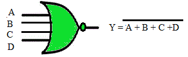
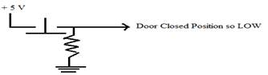
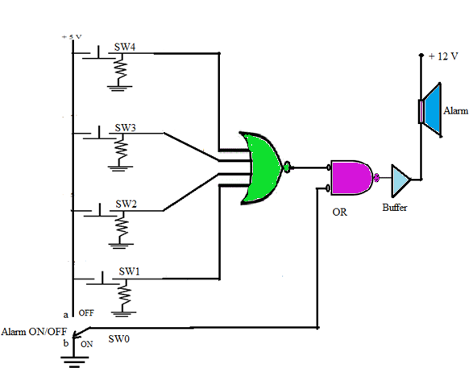

1 INTRODUCTION

Gates with more than two inputs also exist. IC 74LS27 has triple 3-input NOR gates and CMOS IC 74HC4002 has a dual 4 - inputs NOR gates. To design an alarm circuit for a car with four doors such multiple input gates can be used.

1.1 FOUR - INPUT NOR GATE
|Description | Produces a HIGH output only if all the inputs are HIGH. |
|-------|--------------------|
|Symbol||
|Truth Table||  

1.2 APPLICATION: AUTOMOBILE ALARM SYSTEM

Consider four push buttons switches mounted on the door of an automobile/car. Each input to the NOR gate has a *pull-down* resistor to pull the inputs to the gate LOW. Refer Fig.1   

  

Figure 1 Pull-down resistor pulling the input to the gate LOW   

1.3 CONCEPT:  

  The alarm will sound when any one or all of the door-mounted normally closed (NC) push button switches are released (closed) by a door opening.

The bubble at the output of the gate suggests that the alarm is activated when the output of the gate is LOW (*active-low output*). An OR gate is equivalent to a bubbled NAND gate. The *buffer* is required to provide extra current to drive the alarm circuit.  

  

Figure 2 Simple Automobile Alarm System  

Explanation:

1. SW0 is to Enable/Disable the Alarm System.

2. When SW0 is at position 'a', regardless of the status of door open/closed, the alarm system is disabled.

3. When SW0 is at position 'b', the alarm system is enabled. Once enabled, and if one or more doors of the car are opened, then one or more inputs go HIGH and produce a LOW output. This sets the alarm ON indicating the open door status.

4. When all auto/car doors are closed, all the input switches are in the position shown in Fig.2. The inputs to the NOR gate are LLLL and this causes a HIGH output and the alarm is in deactivated mode.

2 PROCEDURE:

1. Push the switch SW0 at position 'a' i.e. green indication and observe that irrespective of door position, the alarm system is disabled and output LED turns GREEN.

2. Now set the switch SW0 at position 'b' (i.e. grey position). The alarm system is enabled. Then change the switch positions SW1, SW2, SW3 and SW4 to simulate the open/close door status and observe when the alarm sounds. The alarming condition is shown with the help of output LED turning RED.

3. If any or all the doors are opened (SW showing RED indication), then check whether you can LISTEN to the output ALARM & verify the result.
